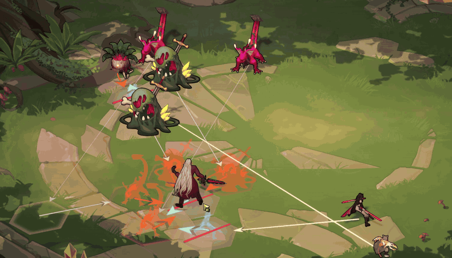
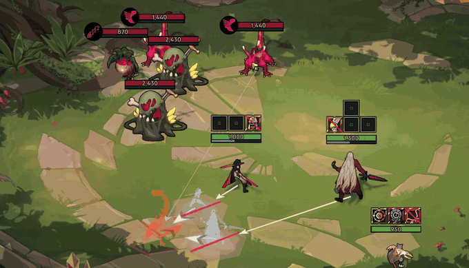
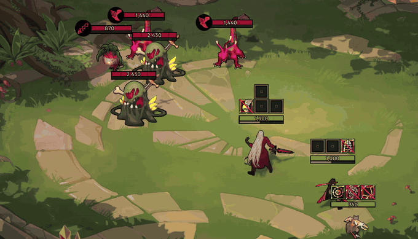
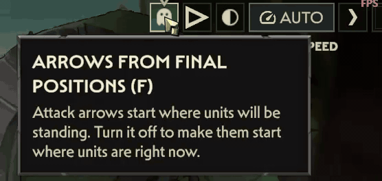
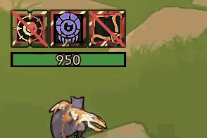
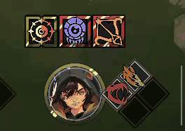
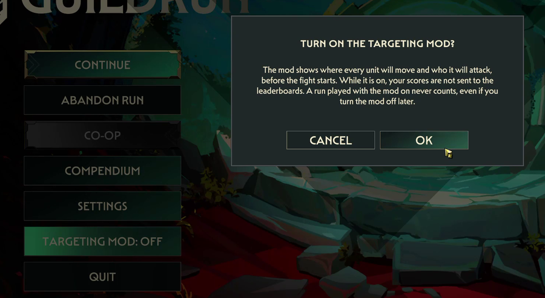

# Guildrun Targeting Preview

**See how the fight is going to start, while you are still placing your heroes.**
A mod for the Guildrun Demo on Steam.

[](https://github.com/Larsonix/GuildrunTargetingMod/releases/latest)
[](https://github.com/Larsonix/GuildrunTargetingMod/releases)
[](LICENSE)




Hover a unit to see where it ends up standing and who it ends up fighting. Hold a hero and the
whole board answers for the hex under your cursor, so you see the result before you drop it.

The mod does not change the fight. It only shows what was already going to happen.

> [!IMPORTANT]
> **A run counts for the Steam leaderboards only if the mod was switched off for the whole of it.**
> A button in the main menu switches the mod on and off at any time, without closing the game and
> without deleting anything. [Details.](#scores-and-leaderboards)

## Download

[](https://github.com/Larsonix/GuildrunTargetingMod/releases/download/v2.1.0/GuildrunTargetingMod-v2.1.0-with-MelonLoader.zip)
[](https://github.com/Larsonix/GuildrunTargetingMod/releases/download/v2.1.0/GuildrunTargetingMod-v2.1.0-mod-only.zip)

* **With MelonLoader** if you have never installed a mod for this game. It contains everything.
* **Mod only** if you already have MelonLoader.

Every version is on the [releases page](https://github.com/Larsonix/GuildrunTargetingMod/releases).
If your browser or your antivirus refuses the file,
[here is the fix](#if-your-browser-or-your-antivirus-blocks-the-download).

## Install

1. In Steam : right click **Guildrun Demo** > **Manage** > **Browse local files**.
2. Drag the content of the zip into that folder. If Windows asks to replace files, say yes.
3. Launch the game normally.

The first launch with the full zip takes a minute or two and needs internet : a black console
window opens while MelonLoader sets itself up. Every launch after it is instant. The preview works
from your very first placement.

On Linux or a Steam Deck there is [one extra step](#linux-and-steam-deck).

## Remove it

Delete **`version.dll`** from the game folder. MelonLoader stops loading and the game is exactly as
it was before.

To remove only this mod and keep your other ones, delete **`Mods\GuildrunTargetingMod.dll`**
instead. To clear every trace, also delete the `MelonLoader`, `Mods`, `Plugins` and `UserData`
folders.

To play for the leaderboards, switching the mod off in the main menu is enough.

## What it shows

**Hover a unit** and you get the unit you point at, the one it fights once the board settles, and
every unit fighting it there. Each with its final position, its movement line and its attack arrow.



**The opening preview** shows the same picture for the whole board at once. Names and health bars
are hidden while it is on.



**Three buttons, three shortcuts.** **P** for the preview, **F** for where attack arrows start,
**T** for see-through units. Each has a tooltip giving its name, its shortcut and what it does.



**Parts that care where a hero stands are marked.** Items, relics, rank modifiers and
specializations that only pay from the front row, from the back row, next to an ally or alone in a
row. When the hero is standing where one of these pays, the hex under them lights up. When it does
not pay, the hex is dimmed with a red line across it, and the item in that hero's row or the relic
in the bar gets a red animated border and a line too.



Open a Hero card and the ability or rank modifier that is switched off is marked, and only that
one : if the same modifier sits on two Heroes and only one is out of position, only that Hero's
copy is marked.



**A wasted Rift Seal is marked.** In a Red Rift run, if winning this fight would charge nothing and
moving the Seal would fix that, the Seal's icon gets a red animated border and a line across it. It
stays quiet when moving it would not help.


Three more things it draws :

* **The ground an ability covers**, as a dashed outline anchored on the unit. Enemies get one too,
  so you can see what to move out of.
* **A unit that jumps.** A Lizard is thrown to your back line the instant the fight starts, before
  it walks anywhere. That jump is a fainter, thinner line, the hex it lands on is marked in grey,
  and its normal movement line carries on from there.
* **The swap**, when you hold a hero over one of your own. On a hex where dropping would change
  nothing, it shows the board unchanged.

Everything is drawn as of the moment the board stops moving. A hero picks a target when the fight
starts, then picks again every time it crosses a hex, so the enemy it opens on is often not the one
it ends up fighting.

Everything disappears when the fight begins. Everything the mod shows exists in English and in
French.

## Scores and leaderboards



**While the mod is switched on, your scores do not go to the Steam leaderboards.** Not the Endless
score, and not the Red Rift win streak.

> A run counts for the leaderboards only if the mod was switched off for the whole of it.

A Red Rift win streak containing such a run stays off that board until the streak restarts.

**The button is in the main menu.** It says whether the mod is on, and pressing it asks you to
confirm. Nothing to close, nothing to delete.

You still see the leaderboards. Your standing is never lowered, and your runs, your unlocks and
your progress are saved the way they always were.

If a game update stops the mod holding submission back, the mod switches itself off, and says so in
the log and on the menu button.

## How it works

The mod does not reimplement the targeting rules. It reads the board, builds it into a battle
configuration, hands it to **the game's own simulation**, runs a few hundred ticks in a throwaway
frame and reads the result. The prediction is exact, including tie breaks and random choices, and a
balance patch updates the preview on its own.

It compares its prediction against the live battle every fight. The check is invisible and never
withholds anything on its own : a fresh install and a new game version both run normally from the
first placement. Two disagreements in a row take the preview away, and one fight that agrees brings
it back.

Apart from holding back leaderboard submission, it changes nothing : not the fight, not the game
state, not your save. Its simulation lives in its own frame and is thrown away.

If one part fails at runtime it turns itself off, logs why, and the rest keeps working.

## Data and privacy

The mod collects nothing and sends nothing. There is no network code in it : no telemetry, no
analytics, no update check.

It writes three files, all inside MelonLoader's `UserData` folder :

| File | When | What is in it |
| --- | --- | --- |
| `MelonPreferences.cfg` | always | Your settings, in the file MelonLoader already keeps for every mod. It also records which game build the mod last checked itself against, and which run was played with the mod on. |
| `GuildrunTargetingMod/parity_log.jsonl` | always | One line per battle from the self check above. |
| `GuildrunTargetingMod/ui_census.json` | only with `DevLog` on, off by default | What the mod found in the game's interface, so a bug report can say where the mod was looking. |

They hold game state and nothing else, and you can delete them.

The full zip also contains MelonLoader, unmodified. MelonLoader reaches the internet on first
launch to fetch its own dependencies, which is the minute the install section mentions. The
[mod only zip](https://github.com/Larsonix/GuildrunTargetingMod/releases/download/v2.1.0/GuildrunTargetingMod-v2.1.0-mod-only.zip)
does not contain it.

## Settings

<details>
<summary>Every toggle, shortcut and default</summary>

MelonLoader writes `UserData/MelonPreferences.cfg` beside the game on the first run, and the mod
names that exact path in the log the first time it starts. Under `[GuildrunTargetingMod]` :

| Setting | Default | What it does |
| --- | --- | --- |
| `Enabled` | `true` | Turns the whole mod on or off. The main menu button writes this one too. |
| `DragLivePreview` | `true` | Computes the hex under a held hero. `false` hides the visuals while dragging. |
| `ArrowsFromGhosts` | `true` | Attack arrows start at the predicted positions instead of the current ones. |
| `MidlineArrowheads` | `false` | Adds a direction chevron in the middle of each line. No in-game button : set it here. |
| `TransparentUnits` | `true` | Fades the units for the whole placement so you can see the board through them. |
| `PreviewStartsOn` | `false` | Starts each battle with the opening preview already on. |
| `PreviewKey` | `P` | Key that toggles the opening preview. |
| `ArrowOriginKey` | `F` | Key that toggles where attack arrows start. |
| `TransparencyKey` | `T` | Key that toggles see-through units. |
| `TickBudgetMs` | `2.0` | Most simulation time allowed per frame during placement. Less is used when your machine has no time to spare. |
| `DragTickBudgetMs` | `6.0` | Most simulation time allowed per frame while dragging. Less is used when your machine has no time to spare. |
| `MarkLapSeconds` | `3.6` | Seconds for one lap of the lights on a marked item's border. `0` keeps the border and stops the motion. |
| `MeasureDrawCost` | `false` | Diagnostic. Briefly blinks the board overlay on and off to measure what drawing it costs your machine. Leave off for normal play. |
| `DevLog` | `false` | Verbose logs, plus a dump of the resolved UI. |

Six more entries appear in the same section and are written by the mod, not by you :
`TestedBuildGuid`, `ParityFailureVersion` and `ParityMismatchStreak` remember whether the preview
has agreed with the game, and `ModdedRunId`, `ModdedChallengeStreak` and `LeaderboardNoticeShown`
are how the leaderboard rule remembers which run was played with the mod on. Do not edit them by
hand.

The arrow origin and the see-through units also have in-game toggles, next to the preview toggle.
Both are remembered between battles and between sessions ; the preview itself starts off in every
battle unless `PreviewStartsOn` says otherwise. The shortcuts work during placement only. A key
name is anything the Unity Input System knows (`P`, `F1`, `Numpad1`, `Backquote`). If a name is not
recognised, that one shortcut falls back to its default and the log says so.

</details>

## Linux and Steam Deck

<details>
<summary>One extra launch option</summary>

The game only ships a Windows build, so it runs through Proton and you take the same zip as
everyone else. There is one extra step. In Steam, right click **Guildrun Demo** > **Properties** >
**General** > **Launch options**, and put this in :

```
WINEDLLOVERRIDES="version=n,b" %command%
```

Without it, Wine ignores the file the loader arrives through and the mod never starts. I have not
tested this myself, so if it gives you trouble please say so.

There is no macOS route today, because there is no macOS build of the game to run.

</details>

## If your browser or your antivirus blocks the download

<details>
<summary>What to do</summary>

Some browsers block the full zip, and some antivirus flags it. What they object to is `version.dll`,
which is MelonLoader and not this mod. MelonLoader works by taking the name of a Windows system file
so the game loads it, and malware does the same thing, so a scanner cannot tell the two apart by
shape alone. Any mod that ships MelonLoader with it runs into this.

If it happens to you, take MelonLoader from its own page and the small zip from here :

1. **[Download MelonLoader.x64.zip](https://github.com/LavaGang/MelonLoader/releases/download/v0.7.3/MelonLoader.x64.zip)**
   straight from LavaGang, who make it. That link hands you the right file directly. If you go to
   [their releases page](https://github.com/LavaGang/MelonLoader/releases/latest) instead, take
   **x64** and not x86 : Guildrun is a 64 bit game, so the x86 one cannot load into it at all, and
   the Linux, macOS and installer files are not for this either.
2. Drag its content into the game folder, exactly like step 2 of the install.
3. Then take the
   [mod only zip](https://github.com/Larsonix/GuildrunTargetingMod/releases/download/v2.1.0/GuildrunTargetingMod-v2.1.0-mod-only.zip)
   and drag its content in as well.

You end up with the same folder either way. The `version.dll` in the full zip is byte for byte the
one LavaGang publishes.

</details>

## Compatibility and building from source

<details>
<summary>Versions, and how to build the zips yourself</summary>

Built for the Guildrun Demo (Unity 6000.0.64f1, IL2CPP) with MelonLoader 0.7.3, which the full
release zip contains unmodified. A game update does not switch the mod off. Everything it reads
from the game is looked up by name at startup and written to the log, so if something it depends on
has moved, the boot log names it and only the part that needed it goes quiet. Balance patches need
no mod update.

To build you need the .NET SDK, and a Guildrun Demo already launched once with MelonLoader, so that
`MelonLoader/Il2CppAssemblies` exists.

```powershell
dotnet build src/GuildrunTargetingMod.csproj -c Release
```

The game path defaults to the usual Steam folder. To use another one, pass it instead of editing
the project file :

```powershell
dotnet build src/GuildrunTargetingMod.csproj -c Release -p:GameDir="D:\Games\Guildrun Demo"
```

To build the two release zips (downloads and verifies MelonLoader, checks the typography of every
source and documentation file, builds, writes the version into the readmes, checks the archives) :

```powershell
pwsh -File packaging/package.ps1
```

Implementation notes, the runtime bindings and the in-game acceptance pass are in
[docs/INTERNALS.md](docs/INTERNALS.md).

</details>

## Credits and licence

This mod is released under the [MIT License](LICENSE).

It runs on [MelonLoader](https://github.com/LavaGang/MelonLoader) by LavaGang, under Apache 2.0.
The full release zip contains MelonLoader unmodified, with its own license and notice files.
Guildrun is made by Leyline, and this mod is not affiliated with them.
